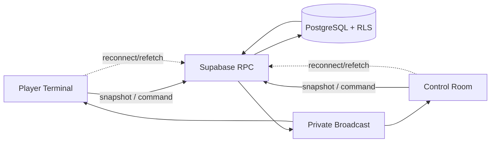

# Architecture

## Componenti

Vite serve SPA React/TypeScript. Player Terminal e Control Room condividono solo contratti non sensibili. Supabase Auth gestisce identità; PostgreSQL conserva stato; RPC applicano comandi atomici; Realtime Broadcast sveglia i client; Netlify serve SPA con fallback.

## Flussi e confini

Commands passano da RPC con auth, target game, preconditions, idempotency key e transaction. Read usa snapshot RPC ridotti per audience. Broadcast contiene solo `event_type`, `game_id`/scope minimo, versione o invalidation hint non segreto. Player non riceve dati Staff; Admin non usa implicitamente altro game.

Scenario definisce contenuto; ScenarioVersion pubblicata congela contenuto; Game istanzia partita e punta a una versione. Nessuna dipendenza runtime da contenuti mutabili.

## Failure handling

Timeout o doppio click → retry con stessa idempotency key. Realtime assente → polling/refetch bounded o azione manuale. Refresh → rebind sessione e snapshot autorizzato. Conflict → RPC rifiuta con stato corrente, client ricarica. Nessuna decisione critica dipende dall’ordine o dalla consegna Broadcast.

## Deployment boundaries

Frontend contiene solo publishable key e config pubblica. Service role resta server-side/operations-only. SPA fallback Netlify necessario per `/admin/*` e `/play/*`. Nessuna migration, seed o modifica remota durante Milestone 0.

La fondazione database resta migration-first: il reset locale ricrea lo schema e i tipi TypeScript generati sono DTO del database, separati dai contratti del dominio. RLS e grants espliciti mantengono il core deny-by-default finché Auth/Join non introduce accessi mirati.

Player Join introduce un solo client browser Supabase con publishable key e session persistence. Anonymous Auth parte solo da CTA Join; RPC server-side derivano identity da `auth.uid()`, validano `is_anonymous` e restituiscono DTO Player-safe. PlayerShell ricarica solo il proprio stato.

Staff usa client browser distinto, stessa URL/key pubblica ma storage key separata. `StaffGate` riconferma sessione e membership attiva tramite RPC prima di esporre route Admin; login fallito o membership revocata porta a login senza leggere games.

Le RPC esposte seguono un confine stabile: wrapper `SECURITY INVOKER` in `public` e implementazione privilegiata `SECURITY DEFINER` nello schema non esposto `private`. Nessuna funzione privilegiata vive in uno schema esposto alla Data API.

## Frontend resilience boundary

L'applicazione usa un Error Boundary globale per fallback di rendering e callback React root per reporting tecnico. Boundary mostra solo messaggi user-safe; logger riceve dettagli tecnici senza trasformarli in UI. Contratti Result/Error e session/recovery restano statici fino all'introduzione autorizzata dell'autorità server.
