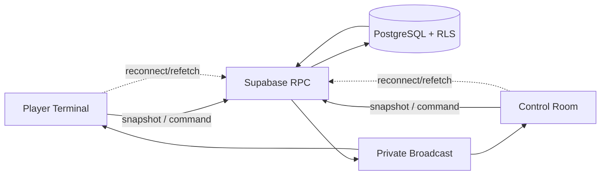

# Architecture

## Componenti

Vite serve SPA React/TypeScript. Player Terminal e Control Room condividono solo contratti non sensibili. Supabase Auth gestisce identità; PostgreSQL conserva stato; RPC applicano comandi atomici; Realtime Broadcast sveglia i client; Netlify serve SPA con fallback.

## Flussi e confini

Commands passano da RPC con auth, target game, preconditions, idempotency key e transaction. Read usa snapshot RPC ridotti per audience. Un trigger PostgreSQL emette su `game:{game_id}` il Broadcast privato `game_state_changed` solo dopo una reale modifica di lifecycle o narrative phase; il payload è solo un kind di invalidazione. Player non riceve dati Staff; Admin non usa implicitamente altro game.

Scenario definisce contenuto; ScenarioVersion pubblicata congela contenuto; Game istanzia partita e punta a una versione. Nessuna dipendenza runtime da contenuti mutabili.

## Failure handling

Timeout o doppio click → retry con stessa idempotency key. Realtime assente → polling/refetch bounded o azione manuale. Refresh → rebind sessione e snapshot autorizzato. Conflict → RPC rifiuta con stato corrente, client ricarica. Nessuna decisione critica dipende dall’ordine o dalla consegna Broadcast.

## Deployment boundaries

Frontend contiene solo publishable key e config pubblica. Service role resta server-side/operations-only. SPA fallback Netlify necessario per `/admin/*` e `/play/*`. Nessuna migration, seed o modifica remota durante Milestone 0.

La fondazione database resta migration-first: il reset locale ricrea lo schema e i tipi TypeScript generati sono DTO del database, separati dai contratti del dominio. RLS e grants espliciti mantengono il core deny-by-default finché Auth/Join non introduce accessi mirati.

Player Join introduce un solo client browser Supabase con publishable key e session persistence. Anonymous Auth parte solo da CTA Join; RPC server-side derivano identity da `auth.uid()`, validano `is_anonymous` e restituiscono DTO Player-safe. PlayerShell ricarica solo il proprio stato.

Staff usa client browser distinto, stessa URL/key pubblica ma storage key separata. `StaffGate` riconferma sessione e membership attiva tramite RPC prima di esporre route Admin; login fallito o membership revocata porta a login senza leggere games.

Le RPC esposte seguono un confine stabile: wrapper `SECURITY INVOKER` in `public` e implementazione privilegiata `SECURITY DEFINER` nello schema non esposto `private`. Nessuna funzione privilegiata vive in uno schema esposto alla Data API.

La Regia usa `list_staff_games` e `get_staff_game_overview` come read model snapshot: ogni RPC autorizza autonomamente una membership Staff attiva e legge i conteggi dal database. `/admin/games/:gameCode` mantiene il game code esplicito; la selezione non è automatica.

La Regia legge il roster con `get_staff_game_roster` e lo mostra per i cinque tavoli e sei posti. Il join Player reale emette lo stesso wake-up `game_state_changed`; la Regia rifà overview e roster, senza usare il payload come stato.

In `live`/`lobby` la Regia può assegnare una sola volta i ruoli tramite comando server-authoritative. Il wake-up è unico per comando e la Regia rifà overview, roster e ruoli; `role_reveal` richiede una assegnazione completa.

Il comando lifecycle segue il confine server-authoritative: PostgreSQL blocca la riga Game, verifica `expected_lifecycle`, applica solo la matrice approvata e scrive l'audit nella stessa transazione. `command_id` rende il retry idempotente; la state machine frontend filtra soltanto l'UX.

Il comando fase narrativa mantiene lo stesso confine: è accettato solo con lifecycle `live`, blocca la riga Game, verifica `expected_phase` e consente esclusivamente il passaggio alla fase successiva nella matrice `lobby`→`role_reveal`→`briefing`→`discovery`→`comparison`→`pressure`→`auction`→`deliberation`→`final_vote`→`reveal`. La mutazione e l'audit append-only sono atomici; `reveal` è terminale e il client mostra una sola azione successiva derivata dallo snapshot.

## Frontend resilience boundary

L'applicazione usa un Error Boundary globale per fallback di rendering e callback React root per reporting tecnico. Boundary mostra solo messaggi user-safe; logger riceve dettagli tecnici senza trasformarli in UI. Contratti Result/Error e session/recovery restano statici fino all'introduzione autorizzata dell'autorità server.
