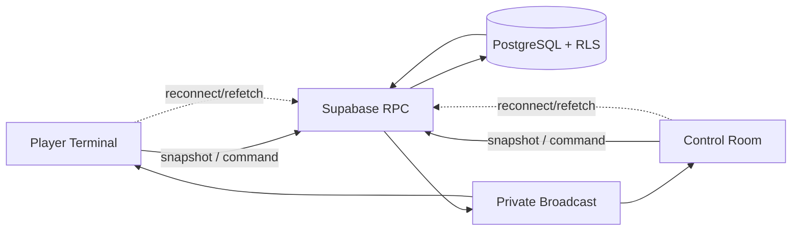

# Architecture

## Componenti

Vite serve SPA React/TypeScript. Player Terminal e Control Room condividono solo contratti non sensibili. Supabase Auth gestisce identità; PostgreSQL conserva stato; RPC applicano comandi atomici; Realtime Broadcast sveglia i client; Netlify serve SPA con fallback.

## Flussi e confini

Commands passano da RPC con auth, target game, preconditions, idempotency key e transaction. Read usa snapshot RPC ridotti per audience. Broadcast contiene solo `event_type`, `game_id`/scope minimo, versione o invalidation hint non segreto. Player non riceve dati Staff; Admin non usa implicitamente altro game.

Scenario definisce contenuto; ScenarioVersion pubblicata congela contenuto; Game istanzia partita e punta a una versione. Nessuna dipendenza runtime da contenuti mutabili.

## Failure handling

Timeout o doppio click → retry con stessa idempotency key. Realtime assente → polling/refetch bounded o azione manuale. Refresh → rebind sessione e snapshot autorizzato. Conflict → RPC rifiuta con stato corrente, client ricarica. Nessuna decisione critica dipende dall’ordine o dalla consegna Broadcast.

## Deployment boundaries

Frontend contiene solo publishable key e config pubblica. Service role resta server-side/operations-only. SPA fallback Netlify necessario per `/admin/*` e `/play/*`. Nessuna migration, seed o modifica remota durante Milestone 0.
